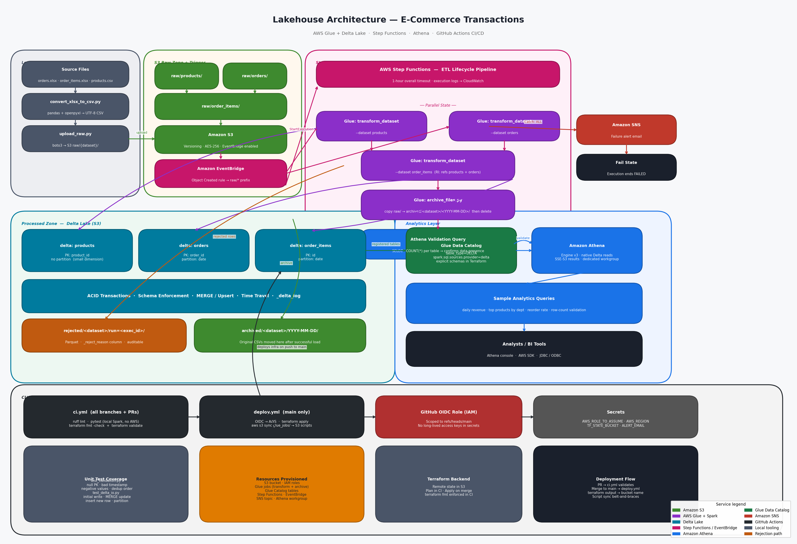

# Lakehouse Architecture for E-Commerce Transactions

Production-grade AWS Lakehouse that ingests raw e-commerce transactional data from S3, cleans and deduplicates it using Delta Lake via AWS Glue + Spark, and exposes it for analytical queries through Amazon Athena. The entire lifecycle is orchestrated by AWS Step Functions and deployed automatically via GitHub Actions.

---

## Architecture



<details>
<summary>ASCII fallback</summary>

```
┌─────────────────────────────────────────────────────────────────────────────────┐
│  Local                                                                          │
│  xlsx ──► convert_xlsx_to_csv.py ──► data_csv/*.csv                             │
│                    │                                                            │
│                    ▼ upload_raw.py                                              │
└─────────────────────────────────────────────────────────────────────────────────┘
                     │
                     ▼
┌─────────────────── AWS ─────────────────────────────────────────────────────────┐
│                                                                                 │
│  S3 raw/{dataset}/           EventBridge (Object Created)                       │
│       │                            │                                            │
│       └────────────────────────────┘                                            │
│                                    │                                            │
│                                    ▼                                            │
│                          Step Functions Pipeline                                 │
│                                    │                                            │
│              ┌─────────────────────┴──────────────────────┐                    │
│              ▼                                             ▼                    │
│   Glue: transform_dataset.py                  Glue: transform_dataset.py       │
│      --dataset products                          --dataset orders               │
│          (parallel)                                  (parallel)                 │
│              └─────────────────────┬──────────────────────┘                    │
│                                    ▼                                            │
│                        Glue: transform_dataset.py                               │
│                           --dataset order_items                                 │
│                        (after reference tables ready)                           │
│                                    │                                            │
│                                    ▼                                            │
│                        Glue: archive_files.py                                   │
│                  raw/ ──► archived/<dataset>/<date>/                            │
│                                    │                                            │
│                                    ▼                                            │
│                   Athena: SELECT COUNT(*) validation                            │
│                                    │                                            │
│             ┌──────────────────────┴───────────────────┐                       │
│             ▼ (success)                                 ▼ (any failure)         │
│         Succeed                               SNS alert → Fail state            │
│                                                                                 │
│  S3 processed/{dataset}/  ◄── Glue Data Catalog ◄── Athena engine v3           │
│    (Delta tables, ACID)                                                         │
└─────────────────────────────────────────────────────────────────────────────────┘
```

</details>

---

## Repository Layout

```
P2/
├── .github/workflows/
│   ├── ci.yml          # lint + pytest + terraform validate (all branches/PRs)
│   └── deploy.yml      # terraform apply + script sync (main only, via OIDC)
├── athena/queries/     # four sample analytics queries
├── glue_jobs/
│   ├── lib/
│   │   ├── config.py       # per-dataset schema, PK, partition, RI rules
│   │   ├── validation.py   # null checks, timestamp parsing, RI anti-join, dedup
│   │   └── delta_io.py     # Delta MERGE helper + CloudWatch metrics
│   ├── transform_dataset.py  # single parametrized Glue ETL job
│   └── archive_files.py      # Python-shell archive job
├── scripts/
│   ├── convert_xlsx_to_csv.py  # pre-flight xlsx → CSV conversion
│   └── upload_raw.py           # upload CSVs to S3 raw zone
├── terraform/
│   ├── providers.tf / variables.tf / locals.tf
│   ├── s3.tf            # bucket + script uploads
│   ├── iam.tf           # Glue, SFN, EventBridge, GitHub OIDC roles
│   ├── glue.tf          # Glue job definitions
│   ├── glue_catalog.tf  # explicit Delta table definitions for Athena
│   ├── step_functions.tf
│   ├── eventbridge.tf
│   ├── sns.tf
│   ├── athena.tf
│   └── outputs.tf
├── tests/
│   ├── conftest.py          # local Spark + Delta fixture
│   ├── test_validation.py
│   └── test_delta_io.py
├── pyproject.toml
└── .gitignore
```

---

## Data Model

### Source Datasets

| Dataset | Primary Key | Partition | Description |
|---|---|---|---|
| `products` | `product_id` | — | Product dimension with department hierarchy |
| `orders` | `order_id` | `date` | Order header with user, timestamp, total |
| `order_items` | `id` | `date` | Line items linking orders to products |

### S3 Zones

| Prefix | Purpose |
|---|---|
| `raw/{dataset}/` | Landing zone for incoming CSVs |
| `processed/{dataset}/` | Delta tables (ACID, versioned) |
| `archived/{dataset}/YYYY-MM-DD/` | Original files after successful ingestion |
| `rejected/{dataset}/run=<id>/` | Rows that failed validation |
| `glue-scripts/` | ETL scripts synced by Terraform |
| `athena-results/` | Query output location |

---

## Design Decisions

**Single parametrized Glue job** — `transform_dataset.py` handles all three datasets through a `--dataset` argument dispatched against `lib/config.py`. This avoids code duplication while keeping per-dataset concerns (schema, PK, partitioning, RI rules) in one authoritative location.

**Explicit schema, no inferSchema** — each dataset declares a `StructType` in `config.py`. Schema drift raises an error at ingest rather than silently widening the Delta table.

**Parallel Step Functions branches** — products and orders have no cross-dependency so they run concurrently. Order items runs after both to enable the referential integrity anti-join. This cuts wall-clock time roughly in half for the two larger tables.

**Delta MERGE (upsert)** — every load is idempotent. Re-running the pipeline for the same file is safe: matched rows are updated to the latest values and no duplicates are inserted.

**Explicit Glue Catalog tables** — table schemas and partition keys are declared in Terraform (`glue_catalog.tf`) rather than inferred by a Glue Crawler. This keeps schema changes in version control and avoids Crawler mis-classifying Delta `_delta_log` directories. Athena engine v3 reads Delta tables natively with the `table_type=DELTA` parameter.

**OIDC for CI/CD** — the GitHub Actions deploy workflow assumes an IAM role via OIDC, scoped to `ref:refs/heads/main`. No long-lived access keys are stored in repository secrets.

**Validation and rejection logging** — every rejected row carries a `_reject_reason` string (e.g. `null_pk:order_id`, `ri_miss:product_id→products.product_id`, `bad_timestamp:order_timestamp`) and is written to the `rejected/` prefix as Parquet for audit and replay.

---

## Getting Started

### Prerequisites

- Python 3.11+, `pip install pandas openpyxl boto3`
- Terraform >= 1.6
- AWS CLI configured with appropriate permissions
- GitHub repository with `AWS_ROLE_TO_ASSUME`, `AWS_REGION`, `TF_STATE_BUCKET`, and `ALERT_EMAIL` secrets

### 1. Convert source xlsx files

```bash
python scripts/convert_xlsx_to_csv.py --data-dir Data --out-dir data_csv
```

Produces `data_csv/products.csv`, `data_csv/orders_apr_2025.csv`, `data_csv/order_items_apr_2025.csv`.

### 2. Deploy infrastructure

```bash
cd terraform
terraform init \
  -backend-config="bucket=<your-tf-state-bucket>" \
  -backend-config="key=lakehouse/terraform.tfstate" \
  -backend-config="region=us-east-1"

terraform apply -var="alert_email=you@example.com"
```

### 3. Upload raw data and trigger the pipeline

```bash
python scripts/upload_raw.py --bucket $(terraform output -raw bucket_name)
```

EventBridge fires automatically when any file lands in `raw/`. To trigger manually:

```bash
# Copy the command from terraform output manual_trigger_command
aws stepfunctions start-execution \
  --state-machine-arn <arn> \
  --input '{"bucket":"<bucket>","key":"raw/orders/orders_apr_2025.csv"}'
```

### 4. Query results in Athena

Open the AWS Athena console, select the workgroup `lh-dev-lakehouse`, and run any query from `athena/queries/`.

---

## Running Tests Locally

The test suite spins up a real PySpark + Delta Lake session against the validation and Delta-merge code. No AWS credentials are required — everything runs against a local SparkSession.

### Option A — Docker (recommended)

`Dockerfile.test` pins a known-good combination (Apache Spark 3.5.0 image + PySpark 3.5.0 + delta-spark 3.1.0 + pytest), avoiding the Python/Java/Spark version juggling that bites locally on Windows.

```bash
docker build -f Dockerfile.test -t p2-test .
docker run --rm -v "${PWD}:/work" -w /work --entrypoint python3 p2-test \
  -m pytest tests/ -v
```

Expected output:

```
================================ test session starts ================================
collected 11 items

tests/test_delta_io.py::TestWriteDeltaMerge::test_initial_write_creates_delta_table  PASSED
tests/test_delta_io.py::TestWriteDeltaMerge::test_merge_updates_existing_row         PASSED
tests/test_delta_io.py::TestWriteDeltaMerge::test_merge_inserts_new_row              PASSED
tests/test_delta_io.py::TestWriteDeltaMerge::test_partitioned_write                  PASSED
tests/test_validation.py::TestValidateNulls::test_rejects_null_pk                    PASSED
tests/test_validation.py::TestValidateNulls::test_passes_non_null_pk                 PASSED
tests/test_validation.py::TestValidateTimestamps::test_rejects_unparseable_timestamp PASSED
tests/test_validation.py::TestValidateTimestamps::test_skips_when_no_ts_col          PASSED
tests/test_validation.py::TestValidateNonNegative::test_rejects_negative_amount      PASSED
tests/test_validation.py::TestDeduplicate::test_keeps_latest_by_timestamp            PASSED
tests/test_validation.py::TestDeduplicate::test_no_duplicates_unchanged              PASSED

================================== 11 passed ==================================
```

### Option B — Native install

Requires Python 3.8–3.11 (PySpark 3.5 doesn't support 3.12+) and a JDK 8/11/17 on `PATH`.

```bash
pip install pyspark==3.5.0 delta-spark==3.1.0 pytest ruff
pytest tests/ -v
```

> **Windows note:** if `SPARK_HOME` is set to a system Spark install, unset it (`Remove-Item Env:SPARK_HOME`) so PySpark uses its bundled JARs and doesn't mix versions.

---

## CI/CD

| Trigger | Workflow | Steps |
|---|---|---|
| Push or PR to any branch | `ci.yml` | Lint (ruff) → pytest → terraform fmt/validate |
| Push to `main` | `deploy.yml` | OIDC auth → terraform apply → S3 script sync |

GitHub secrets required for `deploy.yml`:

| Secret | Value |
|---|---|
| `AWS_ROLE_TO_ASSUME` | ARN from `terraform output github_actions_role_arn` |
| `AWS_REGION` | e.g. `us-east-1` |
| `TF_STATE_BUCKET` | S3 bucket for Terraform remote state |
| `ALERT_EMAIL` | Email address for SNS pipeline failure alerts |
